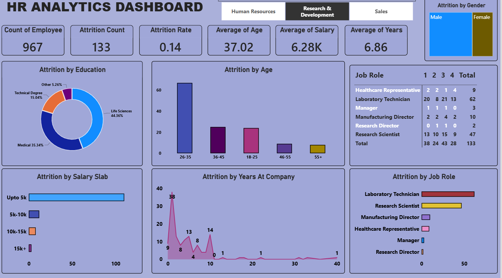

[9:03 AM, 10/5/2026] Diksha: HR Analytics Dashboard
An interactive HR Analytics Dashboard built using Microsoft Power BI to analyze employee attrition, salary, age, years at company, education, gender, and job roles.
Key Insights
Total Employees
Attrition Count and Attrition Rate
Average Age
Average Salary
Average Years at Company
Attrition by Gender
Attrition by Education
Attrition by Salary Slab
Attrition by Age
Attrition by Years at Company
[9:04 AM, 10/5/2026] Diksha: Attrition by Job Role

Tools Used
Power BI
Power Query
DAX
[9:13 AM, 10/5/2026] Diksha: # HR Analytics Dashboard

An interactive HR Analytics Dashboard built using Microsoft Power BI to analyze employee attrition and workforce trends.

## 📊 Dashboard Overview

This dashboard provides insights into:

- Employee Count
- Attrition Count
- Attrition Rate
- Average Age
- Average Salary
- Average Years at Company
- Attrition by Gender
- Attrition by Education
- Attrition by Salary Slab
- Attrition by Age
- Attrition by Years at Company
- Attrition by Job Role

## 🛠️ Tools & Technologies

- Microsoft Power BI
- Power Query
- DAX
- Data Visualization

## 📷 Dashboard Preview

## 🎯 Project Objective

The objective of this project is to analyze employee attrition patterns and identify workforce trends using interactive data visualizations and key performance indicators.

## 👩‍💻 Created By

Diksha 
